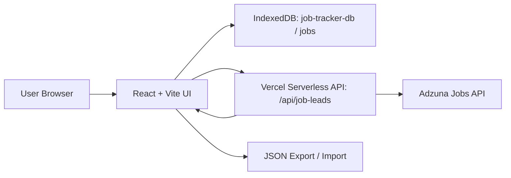

# Job Tracker AI

## Objective

Job Tracker AI is a local-first Kanban app for managing QA, SDET, Test Automation, Test Lead, and Test Architect opportunities. It keeps your saved jobs private in your browser while also giving you a lightweight AI-style command panel for finding fresh QA job leads from top product companies.

## What It Does

- Tracks jobs across `Wishlist`, `Applied`, `Follow-up`, `Interview`, `Offer`, and `Rejected`.
- Persists saved jobs in browser IndexedDB, so refreshes and Vercel redeploys do not erase local data.
- Fetches fresh QA-related jobs through a Vercel Serverless API backed by Adzuna.
- Filters live leads to jobs created within the last 7 days and limits the board to 10 strong matches.
- Scores leads with simple AI-style heuristics: QA relevance, freshness, company priority, role category, resume hint, and fit reasons.
- Suggests referral search links for recruiters, talent partners, QA managers, SDET leads, and engineering managers.
- Supports JSON export/import for backup or moving data between browsers/devices.

## Why This App

Most job trackers are either too manual or too complex. This app keeps the workflow simple:

1. Find fresh QA jobs.
2. Save the best ones to Wishlist.
3. Track each application through the board.
4. Export your data whenever you want a backup.

No cloud database is required for saved jobs, and no AI provider key is required for the demo-friendly scoring.

## Architecture



## Persistence Model

Saved jobs are stored in IndexedDB using the `idb` package:

- Database: `job-tracker-db`
- Object store: `jobs`
- Key path: `id`

Data persists on the same browser and device after refreshes and Vercel deployments. It does not automatically sync across browsers or machines. Use export/import when you want a backup or want to move data.

## Key Features

- Kanban drag and drop powered by `@dnd-kit`.
- Local persistence with IndexedDB.
- Fresh QA Jobs panel for live Adzuna leads.
- One-click save to Wishlist.
- Fit score, role category, resume hint, and reasons.
- Referral search links for each lead.
- Dark mode support.
- JSON export/import.

## Tech Stack

- React 19
- TypeScript
- Vite
- Tailwind CSS v4
- IndexedDB with `idb`
- Vercel Serverless Functions
- Adzuna Jobs API
- Lucide icons

## Local Setup

```bash
npm install
npm run dev
```

Open the local Vite URL shown in the terminal.

On Windows PowerShell, if `npm run ...` is blocked by execution policy, use:

```bash
npm.cmd run dev
npm.cmd run lint
npm.cmd run build
```

## Live Jobs Setup

Create an Adzuna developer account and add these environment variables:

```bash
ADZUNA_APP_ID=your_app_id
ADZUNA_APP_KEY=your_app_key
ADZUNA_COUNTRY=us
```

`ADZUNA_COUNTRY` is optional and defaults to `us`.

For local development, copy `.env.example` to `.env.local` and fill in your real Adzuna values.

The live job API is:

```text
GET /api/job-leads
```

It returns up to 10 QA-related leads from top product companies, created within the last 7 days.

For local testing of `/api/job-leads`, use Vercel's local runtime:

```bash
vercel dev
```

Plain `npm run dev` only starts the Vite frontend, so the board works locally but the serverless job API will not be available there.

## Vercel Deployment

Use these Vercel settings:

- Framework preset: Vite
- Build command: `npm run build`
- Output directory: `dist`
- Environment variables: `ADZUNA_APP_ID`, `ADZUNA_APP_KEY`, optional `ADZUNA_COUNTRY`

Push these files/folders to Git:

- `api/`
- `public/`
- `src/`
- `index.html`
- `package.json`
- `package-lock.json`
- `vite.config.ts`
- `tsconfig.json`
- `tsconfig.app.json`
- `tsconfig.node.json`
- `eslint.config.js`
- `.gitignore`
- `README.md`

Do not push `node_modules/` or `dist/`; both are ignored.

## Git First Push

This folder may not be initialized as a Git repository yet. Start with:

```bash
git init
git add .
git commit -m "Build Vercel-ready Job Tracker AI"
git branch -M main
git remote add origin <your-github-repo-url>
git push -u origin main
```

## Test Checklist

Before pushing/deploying:

```bash
npm.cmd run lint
npm.cmd run build
```

Manual smoke tests:

- Add a manual job, refresh, and confirm it remains.
- Move a job to another column, refresh, and confirm the status remains.
- Export JSON, import it back, and confirm jobs restore.
- Add Adzuna env vars, fetch fresh jobs, and confirm no more than 10 leads appear.
- Save a live lead to Wishlist, refresh, and confirm it persists.

## Limitations

- IndexedDB is local to each browser/device.
- Live job quality depends on Adzuna search coverage and rate limits.
- Referral suggestions are search links, not scraped personal data.
- Fit score is heuristic-based, not an LLM result.

## Adzuna Attribution

Live job leads are powered by Adzuna. The app displays `Jobs by Adzuna` in the Fresh QA Jobs panel to acknowledge the listing source.
